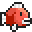
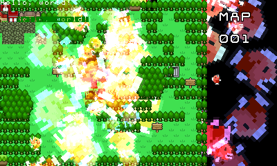

#  SmileBASIC Features for Love2D

This is SmileBASIC, but for Love2D. Except not really.

# Layout

This repo is split into a bunch of separate things.

* `docs/`: Contains where the documentation should be. I say "should be" because this is currently where some To-do lists and API specs live.
* `game/`: You don't have to worry about anything here. You can easily throw it away. This does have two test programs that test Sprites, Backgrounds, Text, Basic Z-sorting, and... shaders? for some reason?
	* `apiTest.lua`: WHOOAAAAAAA fish (Demonstrates loading a map from a file, Sprite callbacks, Sprite definitions, blend modes, Background callbacks, Text colors, and transparency)
	* `textTest.lua`: Random text colors and printing! Also shaders for some reason! This also demonstrates a "cut out" effect for text with a foreground color of 0 (transparent).
	* `funky.frag`: I split the shader into another file.
	* `hsvtest.png` and `othertest.png`: Both of these are used with the shader I'm messing around with.
* `maps/`: For now, it contains one example map (`map1.v360map`) that you can use. It's in my horrible file format, too!
* `resources/`: Some things in this are important, some things in this aren't.
	* `characters.txt`: Very important. ~~[Stolen from otyaSmileBASIC](https://github.com/otya128/otyaSMILEBASIC/blob/master/SMILEBASIC/resources/fonttable.txt)~~ [Generously donated by 12Me21](https://github.com/TheV360/Love2DSmileBASICLibrary/pull/1). Used for the text layer's font.
	* `sprites.txt`: Relatively important. If you leave these out, that's completely fine. Used for Sprite definitions.
	* `font_8x8.png` and `font_16x8.png`: Not important. If you want some debug fonts, here you go. The 8x8 one is the regular SmileBASIC font. The 16x8 one is made by me.
	* `icon.png`: Not important. Fish.
	* `sprites.png`: Very important. Used in `SmileBASIC/sprites.lua`.
	* `text.png`: Very important. Used in `SmileBASIC/text.lua`.
	* `tiles.png`: Very important. Used in `SmileBASIC/backgrounds.lua`. Inconsistent naming, but okay.
* `SmileBASIC/`: Contains all the modules. Or whatever they're called.
	* `animations.lua`: Unfinished. For animating Sprites and Backgrounds.
	* `backgrounds.lua`: Finished. For creating tile backgrounds.
	* `smilebasic.lua`: Finished? Abstract thing that Backgrounds, Sprites, and Text all inherit from.
	* `sprites.lua`: Finished? For creating movable, rotatable, stretchable, animatable, dyeable pieces of a spritesheet.
	* `text.lua`: Finished. For creating text screens and printing text to them.
	* `zsorting.lua`: Finished? For sorting all things that inherit from `smilebasic.lua`, and drawing them in order.
* `game.lua`: `main.lua` runs this after setting up a bunch of things. I styled it after PICO-8's game loop thing. For now, it's just a game selector. If you want to modify this: use `setup()`, `update()`, and `draw()`.
* `main.lua`: This is the template I usually start with when making things in Love2D.
* `watch.lua`: This is a small library that keeps track of when a condition is met, how long it has happened for, and when it stops being true. Useful for buttons and other inputs.
* `README.MD`: You're already there.

# To-do

* Completely separate the main.lua and everything else. `main.lua` is my Love2D template, and I don't want that to get in the way of anyone wanting to use this.
* The new icon I drew has both the red and blue parts split 50/50. This is not the case in the actual Love2D logo. Too lazy to fix

# Issues? Improvements?

Tell me! I really want to help people port their SmileBASIC programs to other languages so SmileBASIC can live on. Feel free to create an Issue or do a Pull Request! I don't quite know how Git works!

# Credits
* V360 - All of the code, Sprite definition listings
* SmileBoom - Most assets, also for making SmileBASIC
* [12Me21](https://github.com/12Me21) - Better character listings
